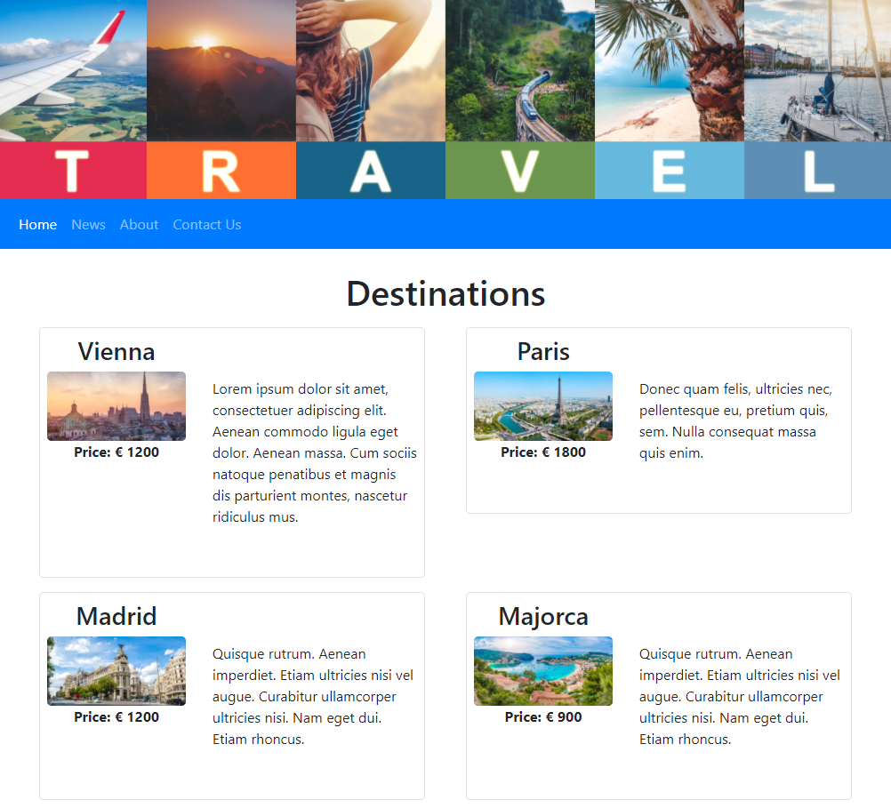

# Symfony Exercise

This is a simple __travel agency__ website using Symfony, TWIG and Bootstrap. It has a home page that pulls journey and destination data from a DB, a news page that pulls news items from a DB and static pages for about page and contact us (non-functional contact form).

